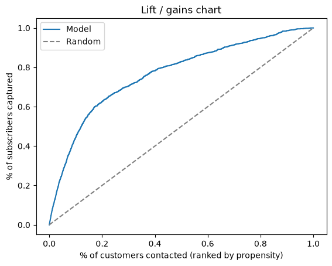
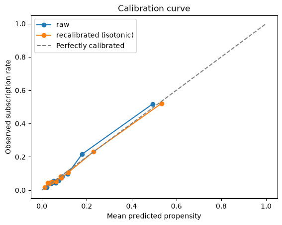
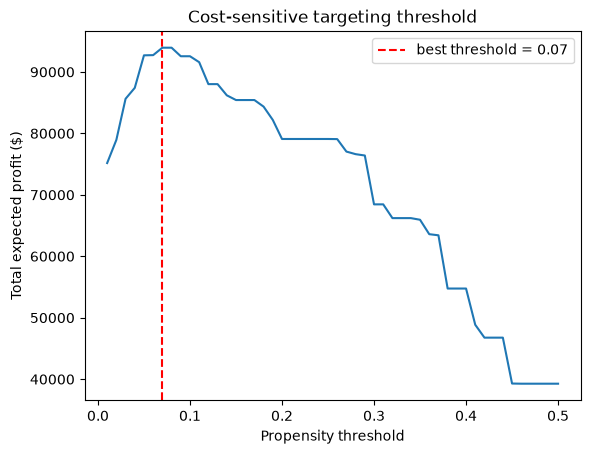
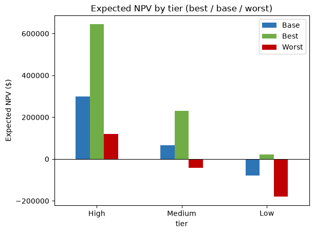
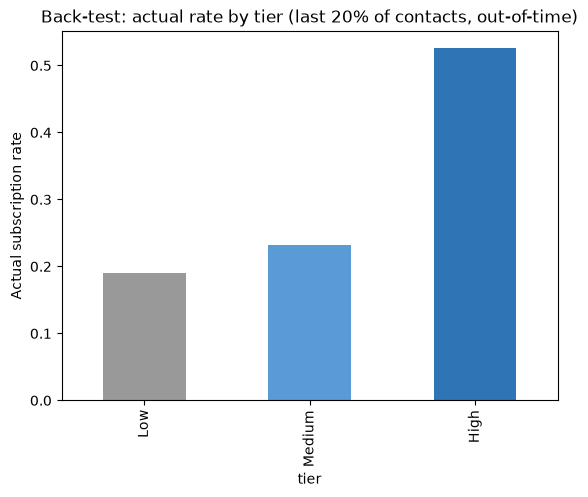

# Cross-Sell Propensity & Customer NPV


Predicts which bank customers will take the next product (a term deposit), proves *statistically*
which customer attributes actually drive that decision, and turns the answer into a segment-level
dollar figure via an NPV model — the same shape of problem as FischerJordan's headline case,
["Models for Long-Term Profitability"](https://fischerjordan.com/using-customer-data-to-develop-models-for-long-term-profitability/)
(40% NPV lift, $1B incremental spend). Real data, Python end-to-end, no LLM — the value here is
statistical rigor, not novelty.

> Replace `PLACEHOLDER_USERNAME` in the badge URL above with your GitHub username once pushed.

## The business question

Of an existing customer base, **which customers should be targeted** for the next-product offer,
**how confident** can we be that the attributes driving the targeting are real signal and not
noise, and **what is the pursuit worth** in dollars once campaign cost and customer retention are
priced in?

## Results at a glance

*(from the reference run committed in this repo — `outputs/`, `figures/`, `target_list.csv`; every
number below was regenerated by re-running the full pipeline end-to-end, not carried over by hand)*

| Metric | Value |
|---|---|
| Dataset | UCI Bank Marketing, `bank-full.csv` — 45,211 customers, 11.7% baseline subscription rate |
| Logistic regression (statsmodels) | AUC 0.773 · PR-AUC 0.419 |
| GBM benchmark (xgboost) | AUC 0.802 · PR-AUC 0.460 — **wins by +0.029**, above the 0.02 switch threshold |
| Calibration (isotonic) | Brier score 0.0810 → 0.0806 |
| Cost-sensitive targeting threshold | 0.070 (vs. a naive default of 0.5) |
| Drivers tested / real drivers found | 15 tested → **8 real** (FDR-significant *and* practically important) |
| Target tiers | High: 5,702 customers, 48.7% avg propensity · Medium: 13,873, 11.5% · Low: 25,636, 3.5% |
| Expected NPV if targeting High + Medium only | **+$373,829** |
| Expected NPV if Low tier is also contacted | **−$77,214** on that tier alone — costs more than it returns |
| Back-test (trained on earliest 80% of contacts, scored on most recent 20%, never seen in training) | Actual subscription rate: High 52.6% · Medium 23.1% · Low 19.1% — ranking held out-of-time |
| Negative control (random split of the already-contacted High tier) | −1.3pp difference, 95% CI −4.6 to +2.0pp, p=0.44 — correctly finds no spurious lift |
| Sample size for a real randomized holdout (5pp MDE, 80% power, 5% significance) | ~1,568 customers per arm — the High tier's 5,702 comfortably covers it |
| Tests | 7/7 passing (`pytest -q`), CI-gated on every push |

**The 8 real drivers**: `poutcome, pdays, previous, campaign, month, contact, housing, job`
(chi-square/t-test, Benjamini-Hochberg corrected for testing 15 candidates at once).

**Bottom line**: target High + Medium tiers (19,575 customers, ~43% of the base) for an expected
+$373,829 NPV; contacting the Low tier destroys value once campaign cost is netted out.

## Visualizations

| | |
|---|---|
|  | **Lift / gains** — ranking customers by model propensity captures subscribers far faster than random targeting would. |
|  | **Calibration** — raw vs. isotonic-recalibrated probabilities against actual observed rate. NPV multiplies propensity × dollars, so this curve is what makes that dollar figure trustworthy, not just the AUC. |
|  | **Cost-sensitive threshold** — total expected profit swept across targeting cutoffs; the peak (0.070) is used instead of a default 0.5. |
|  | **NPV by tier** — Best/Base/Worst expected NPV per tier. Low tier is negative in every scenario except Best. |
|  | **Back-test** — actual subscription rate by predicted tier, on contacts the model never trained on. The ranking held. |

`outputs/segment_tree_rules.txt` (regenerated by `segment.py`, not committed) has the actual
if/else rules the decision tree used to assign tiers — the plain-English reason a given customer
is "High," not just a propensity number.

## Pipeline

```
data/raw/bank-full.csv  (45,211 rows, UCI Bank Marketing)
        │
        ▼
   load.py  ────────────────▶  db/crosssell.db
   CSV → SQLite                 (customers ⋈ campaign_history,
   drops `duration` (leakage)    `duration` excluded on purpose)
                                          │
                                          ▼
                            db.get_modelling_table()
                                          │
        ┌─────────────────────────────────┼─────────────────────────────────┐
        ▼                                 ▼                                 ▼
   model.py                        hypothesis.py                    (re-read by
   logistic (statsmodels)          chi-square / t-test + BH          segment.py and
   + GBM (xgboost) benchmark       → 8 of 15 drivers are real        backtest.py)
   + isotonic calibration
   + cost-sensitive threshold
        │
        ▼
   outputs/propensities.csv
        │
        ▼
   segment.py  ── shallow decision tree ──▶  High / Medium / Low tiers
        │
        ├──▶ target_list.csv          ranked customer list (deliverable)
        ├──▶ build_npv_excel.py  ──▶  npv_model.xlsx   (toggleable assumptions, best/base/worst)
        ├──▶ backtest.py         ──▶  out-of-time validation (figures/backtest_tier_actual_rate.png)
        ├──▶ ab_test.py          ──▶  negative control + required sample size for a real holdout
        └──▶ build_deck.py       ──▶  deck.pptx          (5-slide client deck)
```

## Repo structure

```
Cross-Sell-NPV-Model/
├── README.md
├── requirements.txt          # pinned exact versions
├── .github/workflows/tests.yml  # CI: pytest on every push/PR
├── db.py                     # shared SQLite access — join query + a GROUP BY aggregation
├── features.py               # shared one-hot encoding (model.py / segment.py / backtest.py)
├── assumptions.py            # shared NPV economics (model.py's threshold + build_npv_excel.py)
├── load.py                   # CSV → SQLite
├── model.py                  # logistic + GBM + calibration + cost-sensitive threshold
├── hypothesis.py             # chi-square/t-test + Benjamini-Hochberg
├── segment.py                 # decision-tree tiers → target_list.csv
├── build_npv_excel.py          # npv_model.xlsx + NPV-by-tier chart
├── backtest.py                  # out-of-time validation
├── ab_test.py                     # negative-control split + power calc for a future real holdout
├── build_deck.py                   # 5-slide deck.pptx
├── memo.md                          # 1-page client memo
├── target_list.csv                   # deliverable: customer, propensity, tier, expected NPV
├── npv_model.xlsx                     # deliverable: live-formula NPV model
├── deck.pptx                           # deliverable: client presentation
├── data/
│   ├── README.md
│   ├── DATA_DICTIONARY.md               # every modelling-table column: type, source, description
│   └── raw/bank-full.csv                # gitignored — see data/README.md
├── figures/                            # calibration, lift/gains, profit curve, NPV, back-test charts
├── outputs/                             # intermediate CSVs (gitignored, regenerated by the pipeline)
└── tests/
    ├── test_no_leakage.py                # DB-dependent checks (auto-skip if db/crosssell.db is absent)
    └── test_stats.py                       # pure-function unit tests, always run (this is what CI runs)
```

## Setup & run

```bash
python -m venv .venv
.venv/Scripts/activate   # Windows; source .venv/bin/activate on macOS/Linux
pip install -r requirements.txt
```
Data: see [data/README.md](data/README.md) — `data/raw/bank-full.csv` is expected in place.

```bash
python load.py               # 1. CSV -> SQLite modelling table
python model.py               # 2. logistic + GBM + calibration + cost-sensitive threshold
python hypothesis.py           # 3. chi-square/t-tests + BH correction
python segment.py               # 4. decision-tree tiers + target_list.csv
python build_npv_excel.py        # 5. npv_model.xlsx
python backtest.py                # 6. out-of-time validation
python ab_test.py                   # 7. negative-control check + required sample size for a real holdout
python build_deck.py                 # 8. deck.pptx
pytest -q                             # 7 tests: 2 need db/crosssell.db (skip if absent), 5 are pure-function
```

## Testing & CI

`pytest -q` runs 7 tests: `test_stats.py` covers the pure statistical/financial functions
(`expected_revenue`, `annuity_factor`, `cramers_v`) against hand-computed values, no dataset
required — this is what runs in CI. `test_no_leakage.py` checks the modelling table against the
live database and auto-skips if `db/crosssell.db` doesn't exist yet, rather than failing on a
missing file. `.github/workflows/tests.yml` runs the suite on every push and pull request.

## Engineering rigor (what a senior reviewer checks)

- **No leakage**: `duration` (call length) is only known *after* the outcome — excluded at the SQL
  layer in `db.py`, enforced by `tests/test_no_leakage.py`.
- **Calibration before dollars**: NPV multiplies propensity × revenue, so an uncalibrated model
  quietly produces a wrong dollar figure. `model.py` checks Brier score before/after isotonic
  recalibration and only uses whichever is actually better.
- **Statistical correction, not raw p-values**: 15 candidate drivers were tested; Benjamini-Hochberg
  keeps the false-discovery rate honest instead of reporting whatever clears p < 0.05 by chance.
  Significance and practical importance (Cramér's V / Cohen's d) are reported separately.
- **Cost-sensitive, not default 0.5**: the targeting cutoff (0.070) is chosen by sweeping a profit
  curve, not by defaulting to the classification textbook's 0.5.
- **Out-of-time back-test**: the tier ranking is validated on the most recent 20% of contacts,
  held out of training entirely — not just cross-validated on shuffled data. `backtest.py` also
  prints which feature columns had to be dropped because a category was unseen in the training
  period (one, in the reference run: `month_sep`), instead of silently ignoring it.
- **Reproducible**: `requirements.txt` pins exact versions; `.github/workflows/tests.yml` proves
  the test suite passes on a clean environment, not just "on my machine."
- **Correlation isn't causation, and the memo says so**: every customer in this dataset was already
  contacted, so there's no real control group — `ab_test.py` runs a negative-control split to prove
  the test doesn't manufacture a false lift on its own, then reports the sample size (~1,568/arm) a
  genuine future randomized holdout would need, instead of quietly claiming causality the data can't
  support.

## Skills demonstrated → JD mapping

| JD requirement | Where |
|---|---|
| Strong programming skills (Python) | Whole repo — 7 pipeline scripts + 3 shared modules (`db.py`, `features.py`, `assumptions.py`), no copy-pasted logic |
| SQL / database structures | `db.py` — a join across `customers`/`campaign_history`, plus a `GROUP BY` aggregation (subscription rate by job) |
| Predictive modelling under rigor | `model.py` — logistic + GBM benchmark, calibration, cost-sensitive threshold |
| Statistical analysis / attention to detail | `hypothesis.py` — chi-square/t-test + FDR correction |
| Data extraction, validation, combination | `load.py` — raw CSV → validated, leakage-checked modelling table |
| Database structures / data dictionaries | `data/DATA_DICTIONARY.md` — every modelling-table column: type, source, description |
| Complex Excel financial modelling | `build_npv_excel.py` — live-formula NPV, best/base/worst scenarios |
| Quantitative analysis / experimental design | `ab_test.py` — negative-control check + power calculation for a real randomized holdout |
| Actionable deliverable + measured results | `target_list.csv`, `backtest.py` (validates the projection actually holds) |
| Client presentations | `build_deck.py` — 5-slide deck built from the pipeline's own numbers |

## Deliverables

[`target_list.csv`](target_list.csv) · [`npv_model.xlsx`](npv_model.xlsx) · [`deck.pptx`](deck.pptx)
· [`memo.md`](memo.md) · charts in [`figures/`](figures/)
